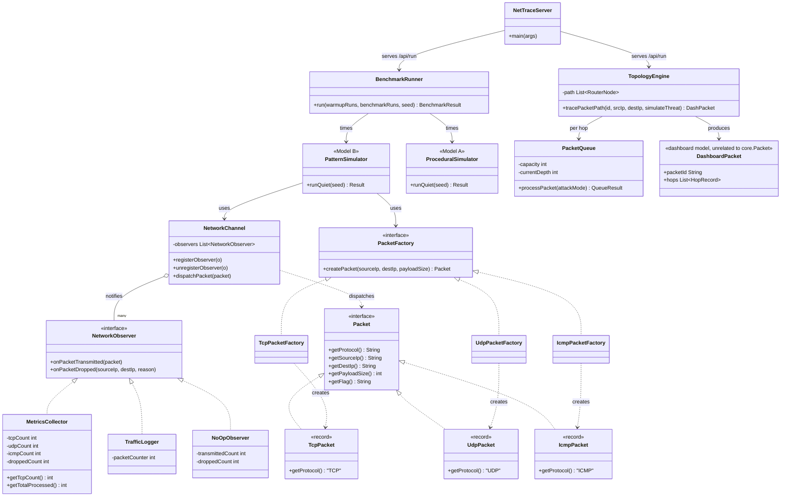

# NetTrace

[](https://nettrace.onrender.com/)

Click the badge above for the running dashboard at
[nettrace.onrender.com](https://nettrace.onrender.com/) — it's the actual
Java backend on Render, not a static screenshot. First load may take a
few seconds if the free-tier instance was asleep.

A live network-routing & threat-detection simulator that runs the *same*
workload two ways — a plain **procedural** implementation and a
**Factory + Observer** pattern-driven implementation — and measures the
real, live cost of the abstraction on every request.

```
Model A (procedural)  ──┐
                         ├──►  BenchmarkRunner  ──►  /api/run  ──►  dashboard
Model B (Factory+Observer) ──┘
```

## Why

"Design patterns add overhead" is usually an opinion. NetTrace turns it
into a number: both models process an identical, seeded synthetic packet
stream, and the measured latency difference (the **"abstraction tax"**) is
shown live in the dashboard, not hardcoded from a one-time offline run.

## Features

- 5-hop packet routing simulation with per-node queue backpressure
- Threat detection at a simulated firewall node, toggleable "attack mode"
- Synthetic packet stream classified by a genuinely trained logistic
  regression (`AiThreatClassifier`) — not a coin flip or hardcoded rule;
  see `training/train_threat_classifier.py`
- Live Model A vs Model B latency benchmark, charted in real time
- In-browser JUnit test runner (`/api/tests`) that surfaces backend
  assertions in the UI
- CSV export of the synthetic packet stream

## Tech stack

- Java 21, built with Maven, packaged as a shaded/fat JAR
- `com.sun.net.httpserver.HttpServer` (JDK built-in, no framework)
- JUnit 5 for tests
- Vanilla HTML/CSS/JS dashboard (Chart.js for the latency graph)
- Docker multi-stage build for deployment

## AI model — threat classifier

`AiThreatClassifier` is a **logistic regression** trained offline with
scikit-learn (`training/train_threat_classifier.py`) on 30,000 synthetic,
labeled packets. The learned weights (5 of them, plus a bias) are hardcoded
into the Java class, so the running server has zero ML library dependency —
inference at request time is just a dot product and a sigmoid.

**Features (5):**

| Feature | Description |
|---|---|
| `payload / 1500.0` | Normalized payload size |
| `is_syn` | 1 if TCP flag is `SYN` |
| `is_suspicious_port` | 1 if destination port isn't 80 or 443 |
| `is_high_src_port` | 1 if source port > 60000 |
| `is_icmp` | 1 if protocol is `ICMP` |

**Decision rule:** `sigmoid(w·x + b) > 0.5` ⇒ classified as a threat
(`AiThreatClassifier.THREAT_THRESHOLD`).

**Accuracy:** ~83% on the training set (30,000 synthetic samples, printed
by the training script as `model.score(X, y)`). Note this is *training*
accuracy, not held-out/test accuracy — the script doesn't do a train/test
split, so treat 83% as an upper-bound sanity check rather than a
generalization guarantee.

**Honesty notes (also in the class Javadoc):**
- Trained on **synthetic**, seeded data — not real network traffic.
- Intentionally simple: 5 hand-picked features, no hidden layers, no
  regularization tuning, no cross-validation.
- Built for a course project / demo, not a production intrusion detection
  system.
- The synthetic data generator overlaps the two classes on purpose (e.g.
  payload size is drawn from overlapping normal distributions for benign
  vs. attack) so no single feature perfectly separates threat from
  non-threat — this is meant to make the ~83% figure meaningful rather
  than trivially 100%.

To retrain (e.g. with different features or a larger dataset):
```bash
pip install numpy scikit-learn
python3 training/train_threat_classifier.py
```
This prints the new accuracy and the 6 constants (`W_PAYLOAD`, `W_SYN`,
`W_SUSPICIOUS_PORT`, `W_HIGH_SRC_PORT`, `W_ICMP`, `BIAS`) to paste back
into `AiThreatClassifier.java` — there's no runtime model-loading step.

## Project layout

```
com.nettrace
├── NetTraceServer.java        # HTTP server + request handlers
├── Packet.java                # dashboard's packet/hop display model
├── PacketQueue.java           # dashboard's queue/backpressure simulation
├── TopologyEngine.java        # dashboard's 5-hop routing simulation
├── AiThreatClassifier.java    # trained logistic regression, packet threat scoring
├── benchmark/
│   └── BenchmarkRunner.java   # runs Model A vs Model B, computes the tax
├── modelA_baseline/
│   └── ProceduralSimulator.java   # Model A — no design patterns
└── modelB_patterns/
    ├── core/                  # Packet, PacketFactory, NetworkObserver (interfaces)
    ├── factory/                # Tcp/Udp/IcmpPacket + their factories
    ├── observer/                # MetricsCollector, TrafficLogger, NoOpObserver
    ├── channel/
    │   └── NetworkChannel.java # the Observer "Subject"
    └── PatternSimulator.java  # Model B — Factory + Observer wired together

training/
└── train_threat_classifier.py # offline training for AiThreatClassifier (scikit-learn)
```

> `com.nettrace.Packet` (dashboard display model) and
> `com.nettrace.modelB_patterns.core.Packet` (the pattern being
> benchmarked) are intentionally separate, unrelated classes in different
> packages — the dashboard's routing visualization doesn't use Factory or
> Observer at all. That said, two things about the topology view *are*
> genuinely tied to real measurements/inference (see "Benchmark
> methodology" below): Model A's displayed hop delays are scaled by the
> actual measured Model A/B duration ratio from that request, not a
> hardcoded constant, and the "Core AI Firewall" hop's threat flag comes
> from a real `AiThreatClassifier` call, not an attack-mode boolean.

## UML — class diagram



> Note: `DashboardPacket` above is `com.nettrace.Packet` — renamed only in
> this diagram to avoid visual confusion with `Packet` (the interface in
> `modelB_patterns.core`). They are unconnected classes in the real code.

## Running it

**Requirements:** Java 21, Maven.

```bash
# Run the dashboard server (defaults to port 5000, or $PORT)
mvn compile exec:java -Dexec.mainClass=com.nettrace.NetTraceServer
# or, after packaging:
mvn clean package
java -jar target/nettrace-1.0-SNAPSHOT.jar
```

Then open `http://localhost:5000`.

**Run the tests:**
```bash
mvn test
```

**Run either model's standalone CLI benchmark:**
```bash
mvn compile exec:java -Dexec.mainClass=com.nettrace.modelA_baseline.ProceduralSimulator
mvn compile exec:java -Dexec.mainClass=com.nettrace.modelB_patterns.PatternSimulator
```
> Note: `BenchmarkRunner` itself currently has no `main()` method, so there
> is no standalone CLI command for it yet — the only way to exercise it
> today is indirectly, via `GET /api/run` (live, 200 warmup / 15 timed
> passes) or via the JUnit tests in `PatternEngineTest` (a handful of
> passes, for correctness, not for a real measurement). Add a `main()`
> to `BenchmarkRunner.java` if a standalone offline benchmark command is
> needed later.

**Docker:**
```bash
docker build -t nettrace .
docker run -p 5000:5000 nettrace
```

## API

| Endpoint | Description |
|---|---|
| `GET /` | Dashboard UI |
| `GET /api/run?srcIp=&dstIp=&mode=&batchSize=&enforceFirewall=` | Runs one live trace + live Model A/B benchmark, returns JSON. Returns 400 with `{"error": "..."}` for invalid input. |
| `GET /api/tests` | Runs backend assertions live, returns JSON results for the UI's test panel |

## Benchmark methodology

Both `ProceduralSimulator.runQuiet(seed)` and `PatternSimulator.runQuiet(seed)`:
- perform **zero console I/O** inside the timed region (timing isn't
  polluted by `System.out`)
- are **reseeded on every call** (`seed + passIndex`), so each paired pass
  is reproducible and directly comparable between the two models, even
  though the seed itself increments across passes within a run
- are preceded by untimed warm-up passes to let the JIT compiler settle
  before timing starts. The live dashboard (`NetTraceServer`) currently
  requests **200 warm-up passes** per `/api/run` call, and
  `BenchmarkRunner.run()` additionally enforces a floor of 25 warm-up
  passes even if a caller asks for fewer

`BenchmarkRunner` reports the average over **15 timed passes** per live
request (`LIVE_BENCHMARK_RUNS`), and before averaging it applies a
**trimmed mean**: for each model, the fastest 1 and slowest 3 of the
timed samples are discarded, so a single JIT hiccup or GC pause (more
likely to spike a run slow than fast on a shared-tenant deployment)
doesn't skew the reported average.

### How the topology view ties into this

`GET /api/run` now includes `"model_a_ratio"` — `avgModelAMs / avgModelBMs`
from that exact request's `BenchmarkRunner` pass. The dashboard uses this
to scale Model A's displayed hop delays (`h.delay_ms * model_a_ratio`),
replacing a previous hardcoded `* 0.92` client-side guess. This means "how
much faster Model A's hop trace looks" now moves with the real, live
measurement each request — including its natural run-to-run noise —
instead of a fixed constant.

Separately, `TopologyEngine.tracePacketPath()` no longer sets the "Core AI
Firewall" hop's threat flag from `simulateThreat && node == firewall`. It
generates one representative packet (same feature distributions
`SyntheticPacketStream` uses for the packet log, biased by attack mode)
and calls the real `AiThreatClassifier.isThreat(...)` — the same trained
logistic regression, the same scoring code. That means the flag is now
genuinely probabilistic rather than deterministic: attack mode makes a
threat *likely* at that hop (empirically close to the classifier's
training accuracy), not *certain* on every single trace. `NetTraceEngineTest`
was updated accordingly to assert the statistical tendency across repeated
traces rather than a guaranteed hit on any one call.

`GET /api/run` also used to report `"throughput_pps"` and
`"packet_loss_pct"` as two hardcoded values keyed only on `mode` (`14820`
pps / `0.01`% normal, `48500` pps / `3.42`% attack). Both are now derived
from that request's real simulated hop and queue data:

- **`throughput_pps`**: `tracePacketPath()`'s 5 `Packet.HopRecord` entries
  each carry a real `latencyMs` (base latency + `PacketQueue`'s
  `queueDelayMs` backpressure term + jitter). Summing those 5 gives one
  packet's real simulated end-to-end transit time, `totalTransitMs`.
  Throughput is then `(batchSize * 1000.0) / totalTransitMs` — treating
  `batchSize` packets as pipelined back-to-back through that transit time.
  This moves with three real inputs per request: `batchSize` (linear),
  `mode` (attack mode raises `PacketQueue`'s `fillRatio`, which raises
  `queueDelayMs`, which raises `totalTransitMs` and therefore *lowers*
  throughput — the same direction a real congested link would move), and
  ordinary per-hop jitter.
- **`packet_loss_pct`**: `PacketQueue.countOverflowDrops(batchSize,
  attackMode)` runs `batchSize` independent synthetic packets through that
  node's real `fillRatio`/`overflowDrop` math (the same distribution
  `processPacket()` uses, sampled once per packet instead of once per
  hop) and returns how many overflowed. Summed across all 5 hops and
  divided by `batchSize * 5` (total hop-traversals in the batch), then
  ×100. A per-hop-only version (5 samples per request, not `batchSize`)
  was considered and rejected: with this topology's queue capacities,
  normal-mode fill never reaches capacity and attack-mode fill only
  crosses it in a narrow band, so 5 samples would either always read 0%
  or jump in coarse 20%-per-hop steps. Sampling `batchSize` packets per
  hop instead gives a smooth, statistically meaningful percentage that
  also scales with the batch size the client actually asked for.

What's still a simulated approximation, not a real measurement: the base
per-hop network latencies (`baseLatencyMs` for each of the 5 router
nodes), the router queue capacities, and the `fillRatio` ranges /
`queueDelayMs` backpressure formula in `PacketQueue` — those are the
topology and queueing *model* being simulated, analogous to fixed
parameters in a physics engine. `throughput_pps` and `packet_loss_pct`
are genuine outputs computed from that model plus this request's real
`batchSize`/`mode`/random draw, not independently fabricated numbers —
but the model itself is not instrumented from a real network.

> The badge/benchmark-table figures referenced elsewhere for this project
> (4.313 ms / 4.412 ms / +2.30% over 50 runs) came from a specific past
> run. As of this codebase, there is no standalone entry point that
> reproduces exactly that 50-run configuration on demand — see the note
> under "Running it" above. Treat those figures as a real, one-time
> result rather than a number you can currently regenerate with a single
> documented command.

### Request validation and JSON safety

`GET /api/run` validates its query parameters before doing any work, and
returns a clean JSON error (`{"error": "..."}`, HTTP 400) instead of an
uncaught exception or a broken response for:

- a non-numeric `batchSize`
- a `batchSize` outside `1`–`1000`
- a `srcIp`/`dstIp` longer than 64 characters

Any other unexpected failure returns HTTP 500 with a generic JSON error
body, logged server-side, rather than the client seeing a reset
connection.

All string values that end up inside the hand-built JSON response
(`srcIp`, `dstIp`, packet IDs, protocol/flag strings, etc.) are passed
through a small `jsonEscape()` helper before being interpolated, so a
value containing a `"`, `\`, or a raw control character can't break the
response's structure. Query parameters are also properly URL-decoded
(`parseQuery()` no longer just splits on `=` and `&`), so a percent-encoded
value round-trips correctly instead of arriving at the JSON layer still
encoded. `NetTraceServerApiTest` exercises this end-to-end over real HTTP,
including adversarial input containing quotes, backslashes, and newlines.

### A* dynamic routing and firewall enforcement

`dynamic_route` comes from `AStarRouter` searching a separate multi-path
graph (`NetworkGraph`) — six nodes, including two ingress routers and a
bypass link that reaches Egress *without* going through the Core AI
Firewall at all. Because A* optimizes purely on cost, a free search can
legitimately choose that bypass link when it's cheaper, which means a
packet's route is decided without ever being scored by
`AiThreatClassifier`.

`enforceFirewall` (query param on `/api/run`, default `true`) controls
whether that's allowed:

- **`enforceFirewall=true` (default)** — `AStarRouter.findPath(..., NetworkGraph.FIREWALL_NODE)`
  is called with the firewall node as a required waypoint. Internally this
  runs A* twice — start→firewall, then firewall→goal — and concatenates
  the two optimal legs, which is the cheapest path *that is guaranteed to
  include the firewall*, not merely a path that happens to. `bypassed_firewall`
  in the response is always `false` in this mode; the response also
  includes `"enforced_firewall": true` so the dashboard can show the
  "✓ Firewall enforced" badge instead of a warning.
- **`enforceFirewall=false`** — the original free search: A* may pick the
  bypass link if it's cheaper. `bypassed_firewall` reports whether it did,
  and the dashboard shows a warning instead of the badge. Useful for
  seeing the raw cost trade-off the constrained mode is giving up.

In the dashboard, this is the "Firewall Inspection" setting in
**Configuration**, and the **Static / A* / Both** toggle above the
Routing Comparison panel is a separate, purely client-side choice of
which route card(s) to display — both routes are computed on the backend
either way, since the static trace also feeds the throughput and packet
loss metrics.

## UI/UX enhancements

These are implemented in `src/main/resources/index.html` (no backend
changes needed):

- **Animated metric transitions** — `tax-val`, `threat-val`, `pps-val`,
  and `loss-val` ease from their old value to the new one on every run
  instead of snapping, via a small `requestAnimationFrame`-based
  `animateValue()` helper.
- **Accessible tooltips** — a "?" info icon next to "Observer Overhead"
  and "Threats Flagged" opens a tooltip on hover *or* keyboard focus
  (`aria-describedby` + `role="tooltip"`) explaining what the metric
  means, so visitors don't have to read this README to understand them.
- **Loading skeletons** — the four metric cards show a shimmering
  skeleton placeholder while `/api/run` is in flight, and `#run-btn`
  is disabled during the request to prevent double-submits.
- **Toast notifications** — connection errors and CSV-export failures
  now surface as dismissible toasts (top-right) instead of a blocking
  `alert()` popup.
- **Threat explainability** — flagged packets get a "Why?" button that
  expands a row showing which of the classifier's 5 features fired
  (payload size, SYN flag, suspicious port, high source port, ICMP),
  mirroring `AiThreatClassifier`'s own feature extraction client-side.
- **Run history strip** — a scrollable strip under the telemetry chart
  shows the abstraction tax and threat count for the last 8 runs at a
  glance, in addition to the existing 10-run line chart.
- **Accessibility** — `aria-live="polite"` on the metric cards so
  screen readers announce updates, visible `:focus-visible` outlines on
  every interactive element, and `aria-label`s on icon-only buttons.
- **Preference persistence** — theme and last-used source/target IP,
  traffic mode, batch size, and model selection are saved to
  `localStorage` and restored on the next visit.
- **First-run onboarding tour** — a 7-step guided walkthrough (what
  Model A/B are, how to run a simulation, how the AI firewall works,
  static vs. A* routing, firewall enforcement, where Configuration lives)
  shows once for new visitors, dismissible and remembered via `localStorage`.
- **Routing view toggle** — a **Static / A\* / Both** pill toggle above
  the Routing Comparison panel switches which route card(s) are shown;
  choice is remembered via `localStorage`.
- **Firewall enforcement control** — a Configuration setting toggles
  whether the A* search is allowed to pick a path that skips the Core AI
  Firewall (see "A* dynamic routing and firewall enforcement" above),
  with a badge or warning in the routing panel reflecting the current
  mode.

**Still just an idea (not implemented — needs backend changes):**
- Replacing the polling-style "click to run" flow with a streaming view
  (Server-Sent Events or WebSocket) so packets animate through the
  topology as they're generated, rather than the dashboard receiving one
  finished JSON payload per click. This needs `NetTraceServer` to support
  a streaming endpoint, not just a client-side change.
- A side-by-side "diff" view pinpointing exactly where in the 5-hop
  pipeline Model A and Model B's latency diverges, rather than only the
  final aggregate tax — would need per-hop timing broken out by model in
  the `/api/run` response.
